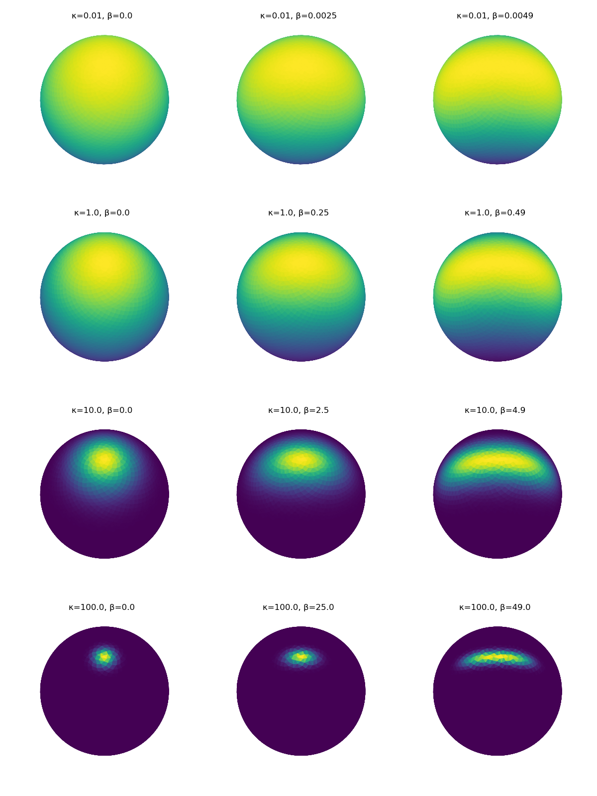

# SphereProba

## Installation
Clone the repository and use pip to install the package.
```bash
git clone https://github.com/rfayat/SphereProba.git
cd SphereProba
pip install -e .  # -e: editable
```
## Generating the example figures
To generate the example figures, install seaborn and [angle_visualization](https://github.com/rfayat/angle_visualization) and run:

```bash
python -m examples.generate_examples
```

## Von Mises Fisher
### Fit from a range of 3D vectors
```python
>>> dummy_data = np.array([[0, 0, 1.], [0, 0.01, 1.01]])
>>> print(VonMisesFisher.fit(dummy_data))
vMF distribution with parameters:
        μ = [0.         0.00495031 0.99998775]
        κ = 81613.99993282309

>>> dummy_data = np.random.random((100000, 3)) - np.array([[.5, .5, .5]])
>>> print(VonMisesFisher.fit(dummy_data))
vMF distribution with parameters:
        μ = [ 0.27893476 -0.72848701 -0.62570127]
        κ = 0.006484827495462602

>>> dummy_data = np.array([[0, 0, 1.], [0, 0, -1]])
>>> print(VonMisesFisher.fit(dummy_data, weights=np.array([1e3, 1])))
vMF distribution with parameters:
        μ = [0. 0. 1.]
        κ = 500.9975019979858
```
### Example for different kappas


## Kent (Fisher-Bingham 5)
### Fit from a range of 3D vectors
```python
>>> dummy_data = np.random.random((10000, 3)) - np.array([[.5, .3, .1]])
>>> print(Kent.fit(dummy_data))
Kent distribution with parameters:
        γ1 = [-0.01238757  0.43245837  0.9015688 ]
        γ2 = [-0.99658471  0.06827784 -0.04644414]
        γ3 = [-0.08164233 -0.89906501  0.4301356 ]
        κ = 2.769705279148834
        β = 0.05539125253921717
```

### Example for different values of kappa and beta

