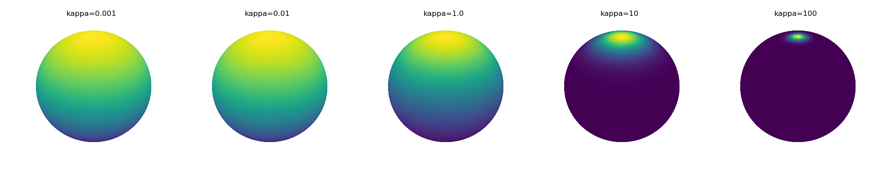

# SphereProba

To generate the example figures, install seaborn and [angle_visualization](https://github.com/rfayat/angle_visualization) and run:

```bash
python -m examples.generate_examples
```

## Von Mises Fisher
### Fit from a range of 3D vectors
```python
>>> dummy_data = np.array([[0, 0, 1.], [0, 0.01, 1.01]])
>>> print(VonMisesFisher.fit(dummy_data))
vMF distribution with parameters:
        μ = [0.         0.00495031 0.99998775]
        κ = 81613.99993282309


>>> dummy_data = np.random.random((100000, 3)) - np.array([[.5, .5, .5]])
>>> print(VonMisesFisher.fit(dummy_data))
vMF distribution with parameters:
        μ = [ 0.27893476 -0.72848701 -0.62570127]
        κ = 0.006484827495462602
```
### Example for different kappas

